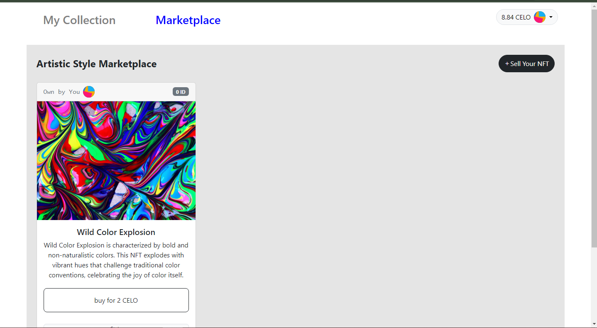

# Artistic Style NFT Collection
[Live Demo](https://johnoladeji.github.io/celo-NFT-marketplace)



# Desciption
Welcome to the Artistic Style Collection! Our web application allows users to create two NFTs per address, a measure put in place to prevent excessive minting. Additionally, users have the option to list their NFTs in the marketplace for sale. You can also view your minted NFTs in the "My Collection" section.

# Key Features
- Mint up to 2 new NFTs
- Customize token metadata, including name, description, and image
- Access and view your own tokens
- Buy and sell tokens on the marketplace, using CELO as the currency
- Connect your wallet (e.g., MetaMask) to interact with the CELO network

# Tech Stack
This web aplication uses the following tech stack:
- [Solidity](https://docs.soliditylang.org/) - A programming language for Ethereum smart contracts.
- [React](https://reactjs.org/) - A JavaScript library for building user interfaces.
- [use-Contractkit](contractkit
) - A frontend library for interacting with the Celo blockchain.
- [Hardhat](https://hardhat.org/) - A tool for writing and deploying smart contracts.
- [Bootstrap](https://getbootstrap.com/) - A CSS framework that provides responsive, mobile-first layouts.

# Usage
1. Install a wallet:
   - [CeloExtensionWallet](https://chrome.google.com/webstore/detail/celoextensionwallet/kkilomkmpmkbdnfelcpgckmpcaemjcdh?hl=en).
   - [MetamaskExtensionWallet](https://chrome.google.com/webstore/detail/metamask/nkbihfbeogaeaoehlefnkodbefgpgknn?hl=en).
2. Create a wallet.
3. Go to [https://celo.org/developers/faucet](https://celo.org/developers/faucet) and get tokens for the alfajores testnet.
4. Switch to the alfajores testnet in the CeloExtensionWallet.

# Test
1. Connect yor wallet to the app. Now you are in Collection section.
1. Create an NFT (fill out all informations: name, description, etc...).
3. List NFT: move into Marketplace section, click on the sell Your NFT button, enter token id and price (token id of the NFT you own).
3. Buy NFT with another account.
4. Check if balance of first account increases.
5. Add another NFT, list into the marketplace.

# Installation
To run the application locally, follow these steps:

1. Clone the repository to your local machine using: ``` git clone  ```
2. Move into folder: ``` cd NFT-Collection ```
3. Install: ``` npm install ``` or ``` yarn install ```
4. Start: ``` npm start ```
5. Open the application in your web browser at ``` http://localhost:3000 ```

# Contributing
1. Fork this repository
2. Create a new branch for your changes: git checkout -b my-feature-branch
3. Make your changes and commit them: git commit -m "Add my feature"
4. Push your changes to your fork: git push origin my-feature-branch
5. Open a pull request to this repository with a description of your changes

Please make sure that your code follows the Solidity Style Guide and the React Style Guide. You can add tests for any new features or changes, also please make the front-end more friendly. I welcome any contributions or feedback on this project!

# Problems
1. The smart contract were not tested carefully (nft-test.js file).
2. The front-end with bootstrap framwork is quite unfriendly.
3. And there are some warnings and errors that I don't know how to fit:
